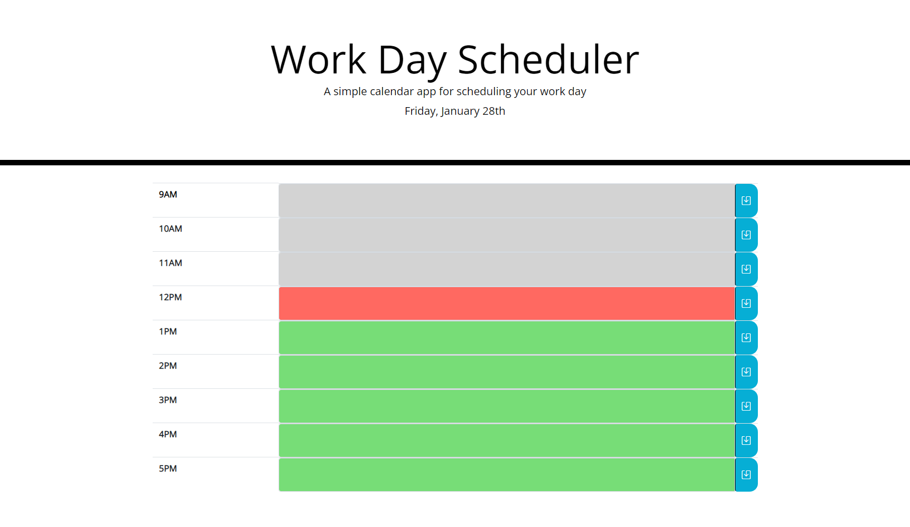

# DayPlanner-HW5

This project allows the user to plan their typical work day. It displays the current day and tracks their progress through the work day by color coding each time chunk. The user can inout events of their day in each time chunk and they will be saved locally.

I gained a greater familiarity with jQuery, bootstap, and moment.js with this project. Partifularly the moment query's and bootraps formand table options. 
I'd like to come back to this project at some point to add multiple days and with that ways to set certain events to repeat.

[SiteLink](will add soon)